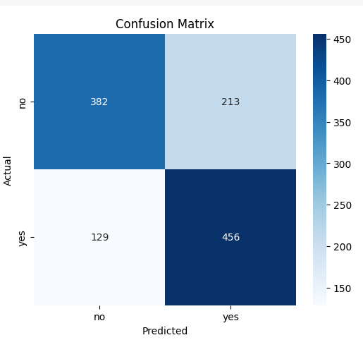
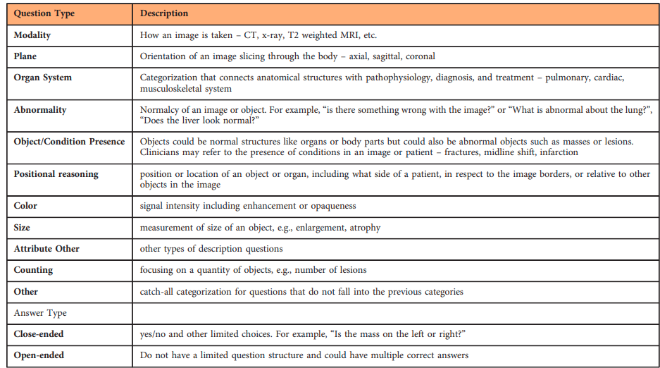

# Quantitative Analysis

-   GPT-4o has a balanced recall for both yes/no classes
-   Qwen 2.5 VL has a high precision for "yes" (0.87) but low recall (0.48), which suggests it's over-cautious in saying “yes”. It says "no" too often and achieves a high no recall, which shows it is biased
-   LLaMA 3.2 is even more biased: recall for "no" is high (0.85), but recall for "yes" is only 0.35, and it has lower precisions than Qwen 2.5 VL

## GPT-4o

```
closed-ended questions in sample: 1299
rows discarded: 119 (expected answer or model answer is not yes/no)
valid rows: 1180
yes: 585
no: 595
```

### Confusion Matrix



### Classification Report

```
Strict Accuracy: 71.02%
Classification Report:

              precision    recall  f1-score   support

          no       0.75      0.64      0.69       595
         yes       0.68      0.78      0.73       585

    accuracy                           0.71      1180
   macro avg       0.71      0.71      0.71      1180
weighted avg       0.71      0.71      0.71      1180
```

### F1 Score by Question Type

```
   question_type  f1_score  count
5          ORGAN  0.967742     17
4       MODALITY  0.960000     72
7          PLANE  0.925373     53
8            POS  0.833333     21
1         ATTRIB  0.819672     47
6          OTHER  0.754098     51
9           PRES  0.706815    624
3          COUNT  0.666667     10
11          SIZE  0.662500    157
2          COLOR  0.600000     32
0            ABN  0.541667    116
10          PRSE  0.000000      1
```

## Qwen 2.5 VL 7b

```
closed-ended questions in sample: 1299
rows discarded: 106 (expected answer or model answer is not yes/no)
valid rows: 1193
yes: 587
no: 606
```

### Confusion Matrix


### Classification Report

```
Strict Accuracy: 71.00%
Classification Report:

              precision    recall  f1-score   support

          no       0.65      0.93      0.77       606
         yes       0.87      0.48      0.62       587

    accuracy                           0.71      1193
   macro avg       0.76      0.71      0.69      1193
weighted avg       0.76      0.71      0.69      1193
```

### F1 Score by Question Type

```
   question_type  f1_score  count
4       MODALITY  0.924731     72
7          PLANE  0.906250     53
5          ORGAN  0.857143     17
3          COUNT  0.833333     10
1         ATTRIB  0.636364     47
8            POS  0.625000     21
9           PRES  0.575406    631
11          SIZE  0.495575    157
2          COLOR  0.461538     32
6          OTHER  0.439024     52
0            ABN  0.411765    121
10          PRSE  0.000000      1
```

## Llama 3.2 Vision 11b

```
closed-ended questions in sample: 1299
rows discarded: 226 (expected answer or model answer is not yes/no)
valid rows: 1073
yes: 528
no: 545
```

### Confusion Matrix


### Classification Report

```
Strict Accuracy: 60.48%
Classification Report:

              precision    recall  f1-score   support

          no       0.57      0.85      0.69       545
         yes       0.70      0.35      0.46       528

    accuracy                           0.60      1073
   macro avg       0.64      0.60      0.58      1073
weighted avg       0.63      0.60      0.58      1073
```

### F1 Score by Question Type

```
   question_type  f1_score  count
4       MODALITY  0.696970     65
5          ORGAN  0.666667     15
3          COUNT  0.545455      8
6          OTHER  0.536585     44
7          PLANE  0.523810     48
9           PRES  0.445013    571
0            ABN  0.437500    108
11          SIZE  0.420000    141
8            POS  0.375000     19
2          COLOR  0.320000     27
1         ATTRIB  0.294118     43
10          PRSE  0.000000      1
```

# Terms



MODALITYPLANEORGAN (Organ System)
ABN (Abnormality)
PRES (Object/Condition Presence)
POS (Positional Reasoning)
COLOR
SIZE
ATTRIB (Attribute Other)
COUNT (Counting)
Other
